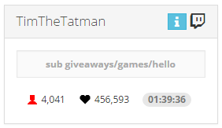

# NodeCG Dashboard

[NodeCG](http://nodecg.com/) bundle showing viewers, followers, uptime, and stream title.

This bundle replaces the need to have the twitch dashboard open.



## Installation

- Install to `nodecg/bundles/nodecg-dashboard`
- Create `nodecg/cfg/nodecg-dashboard.json` and populate with the sample config

### Sample Config

```
{
    "twitchUsername": "fathom_",
    "updateViewerInterval": 15,
    "updateFollowerInterval": 120
}
```

Only `twitchUsername` is required. The other 2 will default to the values above if not explicitly changed.

## Usage

- Panel will be automatically added to your dashboard
- Optionally add `http://localhost:9090/view/nodecg-dashboard` to as a Browser Source to OBS
